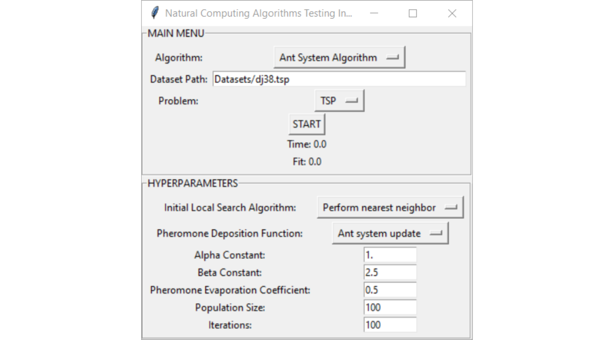
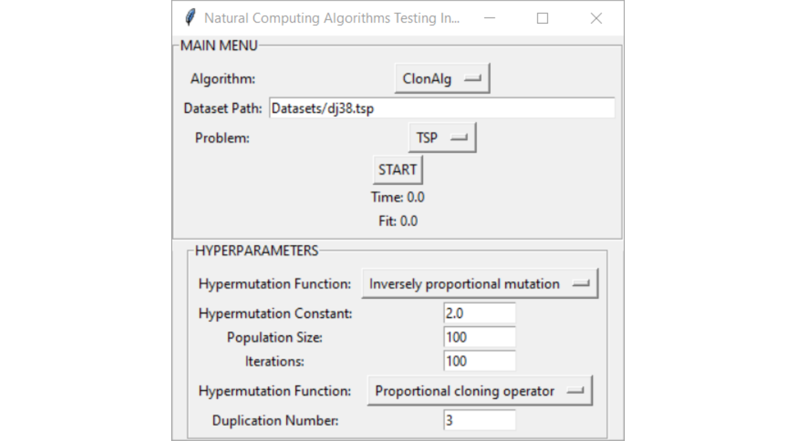
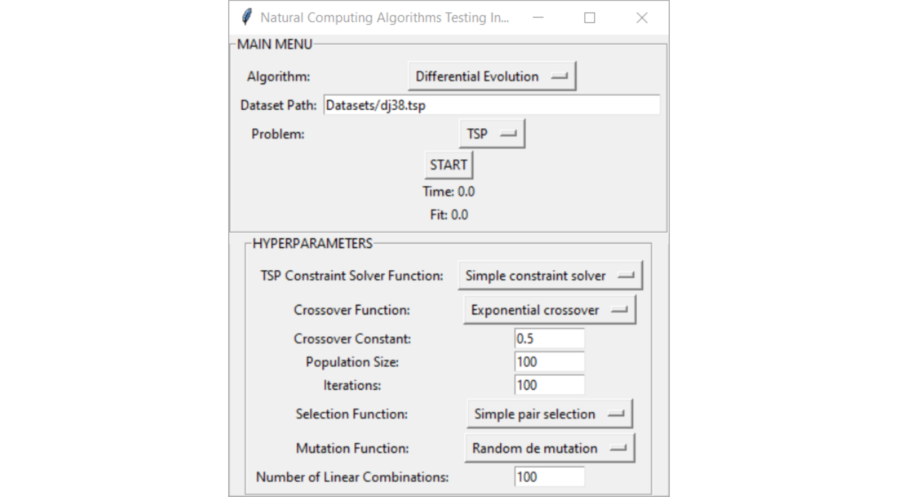
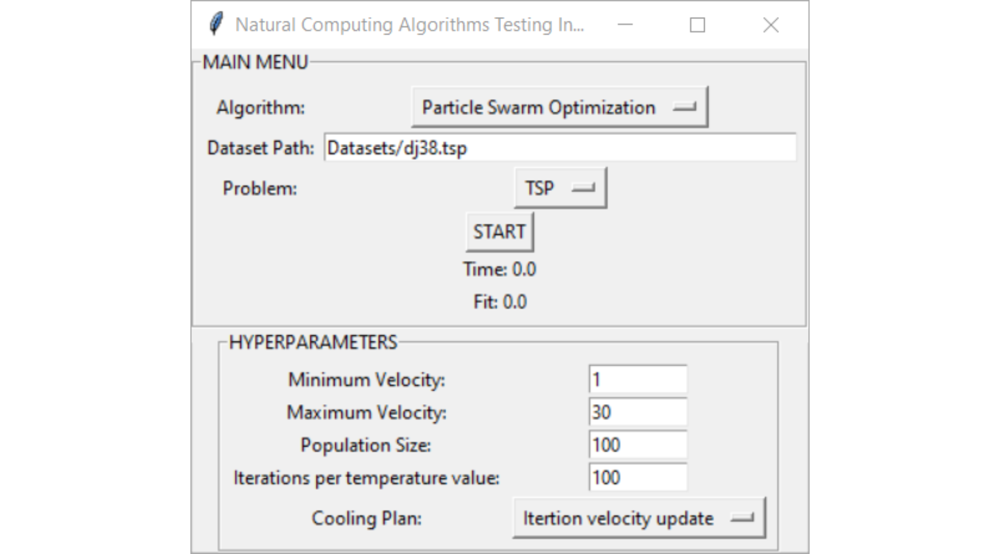
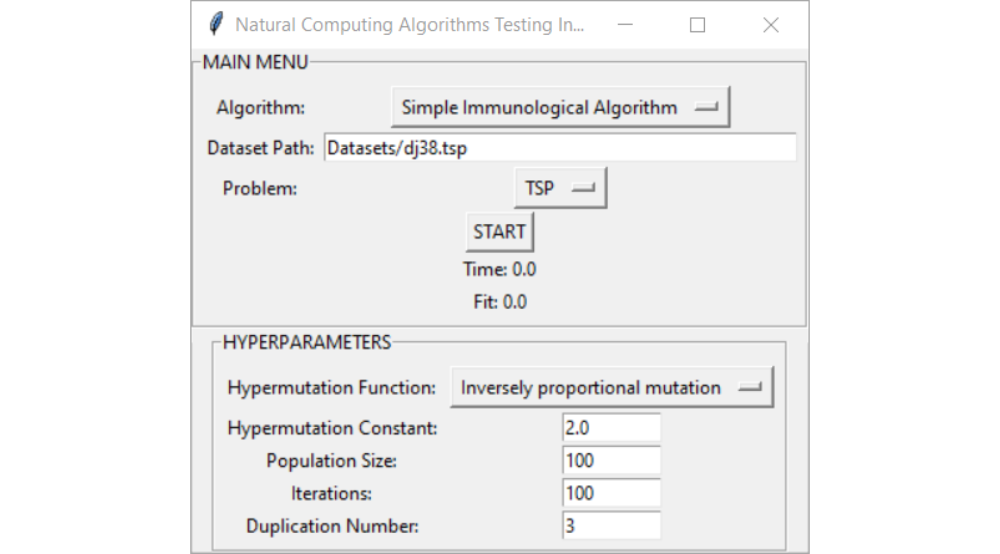
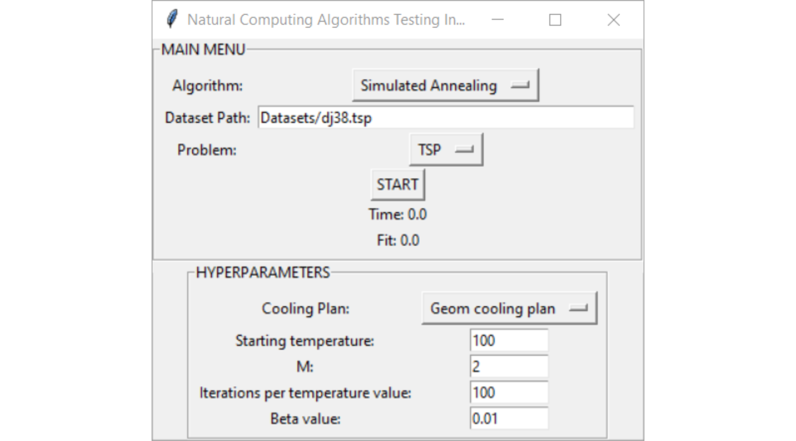

# MetaHeuristic Naturally Inspired Optimization Algorithms
Naturally-inspired optimization algorithms implemented in Python. Genetic algorithm is not present here, because a more detailed version of the Genetic Algorithm was implemented and is present in a separate repository.

Screenshots of the interface:

